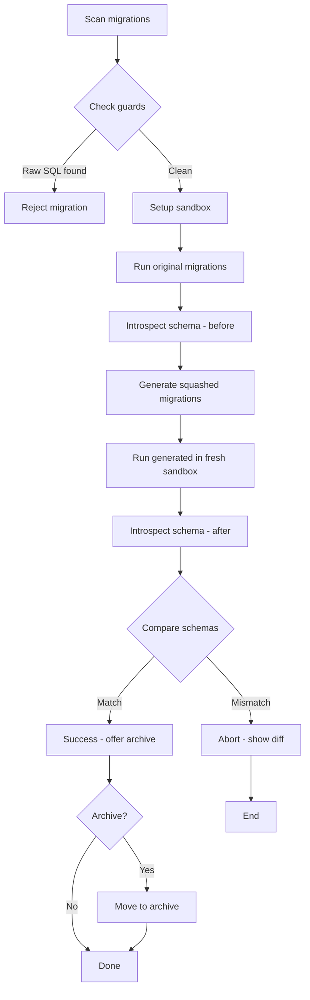

# Laravel Migration Squasher

Package yang menggabungkan (squash) sekumpulan file migration Laravel lama menjadi satu file migration bersih per tabel, dengan verifikasi otomatis bahwa schema hasil akhir identik.

## 📋 Isi

- [Fitur](#fitur)
- [Instalasi](#instalasi)
- [Penggunaan Dasar](#penggunaan-dasar)
- [Options CLI](#options-cli)
- [Contoh Penggunaan](#contoh-penggunaan)
- [Arsitektur](#arsitektur)
- [Testing](#testing)
- [FAQ](#faq)

## Fitur

- ✨ **Auto-generate**: Membuat satu file migration per tabel dari history migration
- 🔒 **Safe verification**: Verifikasi otomatis schema sebelum mengubah apa pun
- 🛡️ **Guard system**: Mendeteksi raw SQL dan data seeding yang tidak bisa di-squash
- ⚡ **High performance**: Menggunakan SQLite in-memory sandbox untuk kecepatan
- 🔄 **Circular FK support**: Menangani foreign key circular dependencies secara otomatis
- 🗂️ **Smart archiving**: Archive migration lama ke folder timestamped

## Instalasi

Tambahkan package ini ke composer.json Anda:

```bash
composer require yourvendor/migration-squash --dev
```

Atau tambahkan manually:

```json
{
    "require-dev": {
        "yourvendor/migration-squash": "^1.0"
    }
}
```

Install dependency parser AST:

```bash
composer require nikic/php-parser
```

## Penggunaan Dasar

### Jalankan squash penuh

```bash
php artisan migrate:squash
```

Command akan:
1. Scan semua migration di `database/migrations/`
2. Group by table berdasarkan operasi Schema
3. Run di sandbox database
4. Introspect schema final
5. Generate file migration baru per tabel
6. Verify schema match
7. Tanya konfirmasi archive

### Dry run (tanpa archive)

```bash
php artisan migrate:squash --dry-run
```

### Check mode (hanya cek masalah)

```bash
php artisan migrate:squash --check
```

Menampilkan migration mana yang punya raw SQL atau data seeding.

## Options CLI

| Option | Description |
|--------|-------------|
| `--dry-run` | Generate dan verify saja, tidak mengarchive migration lama |
| `--check` | Hanya cek migration problematic, jangan jalankan squash |
| `--driver=mysql` | Paksa gunakan MySQL sandbox |
| `--driver=sqlite` | Paksa gunakan SQLite sandbox |
| `--table=orders` | Squash hanya tabel tertentu (bisa repeat) |

## Contoh Penggunaan

### Contoh 1: Project besar dengan 500+ migrations

```bash
# Lihat dulu apakah ada masalah
php artisan migrate:squash --check

# Jika aman, jalankan dry-run
php artisan migrate:squash --dry-run

# Review output migration files, lalu jalankan actual
php artisan migrate:squash
```

Output akan menampilkan:

```
🔍 Laravel Migration Squasher

📂 Step 1: Scanning migrations...
   Found 523 migration files

🧪 Step 2: Setting up sandbox connection...
   Using SQLite in-memory sandbox for speed

⚡ Step 3: Running original migrations in sandbox...
✅ Original migrations executed successfully

📋 Step 4: Introspecting schema...
   Discovered 47 tables

🏗️ Step 5: Generating squashed migrations...
   Generated: 2024_12_15_123456_create_users_table.php
   Generated: 2024_12_15_123456_create_posts_table.php
   ...

✓ Step 6: Verifying generated schema...
✅ Schema verification passed!

📊 Summary:
   • 523 original migration files
   • 47 consolidated files

The following migrations will be archived:
   Archive location: database/migrations/archive/2024_12_15_123456
   Files to archive: 523
   
Continue? [y/N] y

✨ Migrations archived successfully!
```

### Contoh 2: Tabel spesifik saja

```bash
# Squash hanya tabel orders dan order_items
php artisan migrate:squash --table=orders --table=order_items
```

### Contoh 3: Dengan MySQL sandbox (untuk fitur MySQL-specific)

```bash
php artisan migrate:squash --driver=mysql
```

## Arsitektur

### Komponen Utama

```
src/
├── Console/Commands/
│   └── MigrateSquashCommand.php      # Entry point artisan
├── Discovery/
│   ├── MigrationScanner.php          # Parse file migrations
│   └── TableGrouping.php             # Group by table + resolve dependencies
├── Guards/
│   ├── RawSqlDetector.php            # Deteksi DB::statement()
│   ├── DataSeedDetector.php          # Deteksi insert/update/delete
│   └── FileChecker.php               # AST parser untuk security scan
├── Sandbox/
│   ├── SandboxConnectionFactory.php  # Buat SQLite/MySQL temp DB
│   └── SandboxRunner.php             # Jalankan migrations di sandbox
├── Introspection/
│   ├── SchemaIntrospector.php        # Baca INFORMATION_SCHEMA
│   └── Schema/
│       ├── Column.php                # Model column
│       ├── Table.php                 # Model table
│       ├── Index.php                 # Model index
│       └── ForeignKey.php            # Model foreign key
├── Generation/
│   ├── SquashedMigrationGenerator.php # Generate migration code
│   └── Stubs/
│       └── squashed-table.stub       # Template migration
├── Verification/
│   ├── SchemaComparator.php          # Bandingkan schema objects
│   └── SchemaDiff.php                # Result diff report
└── Archiving/
    └── MigrationArchiver.php         # Move files ke archive dir
```

### Flow Chart



## Testing

### Setup test fixtures

```bash
mkdir -p tests/Feature/MigrationSquashFixtures
```

### Contoh test Pest

```php
<?php

use Illuminate\Support\Facades\Artisan;

it('menghasilkan schema identik setelah squash', function () {
    Artisan::call('migrate:squash', ['--dry-run' => true]);
    
    $output = Artisan::output();
    
    expect($output)->toContain('Schema verification passed!');
});

it('menolak migration dengan raw SQL', function () {
    Artisan::call('migrate:squash', ['--check' => true]);
    
    $output = Artisan::output();
    
    expect($output)->toContain('raw SQL terdeteksi');
});

it('menangani circular foreign key dengan benar', function () {
    // Setup fixture circular FK
    $result = app(TableGrouping::class)->resolve(fixture('circular-fk'));
    
    expect($result->deferredForeignKeys())->toHaveCount(1);
});
```

### Fixture kompleks yang harus dicover:

- ✅ Kolom ditambah lalu dihapus
- ✅ Kolom di-rename  
- ✅ Tipe kolom diubah (string → text)
- ✅ Index ditambah lalu drop
- ✅ Foreign key circular dua arah
- ✅ Migration membuat tabel lalu drop total

## FAQ

### Q: Apakah package ini mengubah database production?
**A:** Tidak sama sekali. Package ini hanya generate file migration baru dan optionally archive file lama. Database production tidak tersentuh.

### Q: Bagaimana jika ada migration yang contain raw SQL?
**A:** Migration tersebut akan ditolak dan tidak di-include dalam hasil squash. Anda perlu handle manual migration itu.

### Q: Berapa cepat performance nya dibanding migrate:fresh biasa?
**A:** Secara signifikan lebih cepat di CI karena jumlah file migration jauh berkurang. Misal dari 523 file jadi 47 file berarti ~90% pengurangan eksekusi.

### Q: Apa bedanya dengan migrate:fresh?
**A:** `migrate:fresh` hapus semua table dan jalankan ulang migrations dari awal. Package ini **generate file migration baru** yang sudah representatif schema final tanpa perlu menjalankan ratusan file migration.

### Q: Support PostgreSQL?
**A:** V1 focus ke MySQL dan SQLite. PostgreSQL direncanakan v0.3.

## Changelog

### v0.1 (Current)
- ✅ Dukungan MySQL + SQLite sandbox
- ✅ Guard raw SQL dan data seeding
- ✅ Auto detection driver requirement
- ✅ Circular FK handling basic
- ✅ Schema verification ketat

### Planned
- **v0.2**: Better circular FK, `--table` filter detail
- **v0.3**: PostgreSQL support, optional `--allow-raw` flag
- **v1.0**: Full docs, Pest expectations published

## License

MIT License

---

Built with ❤️ for cleaner Laravel migrations
